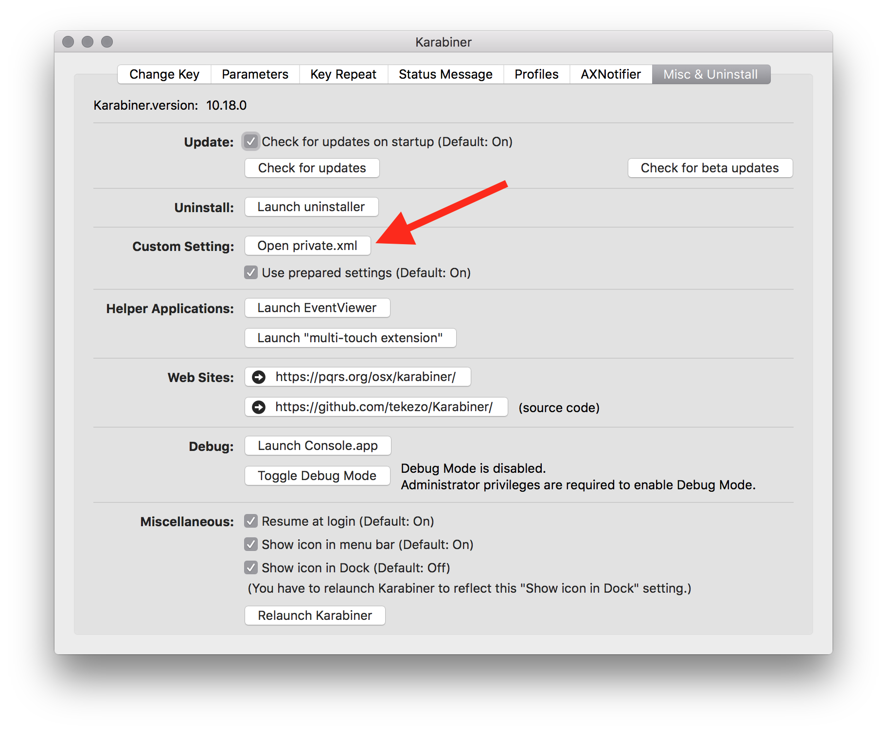
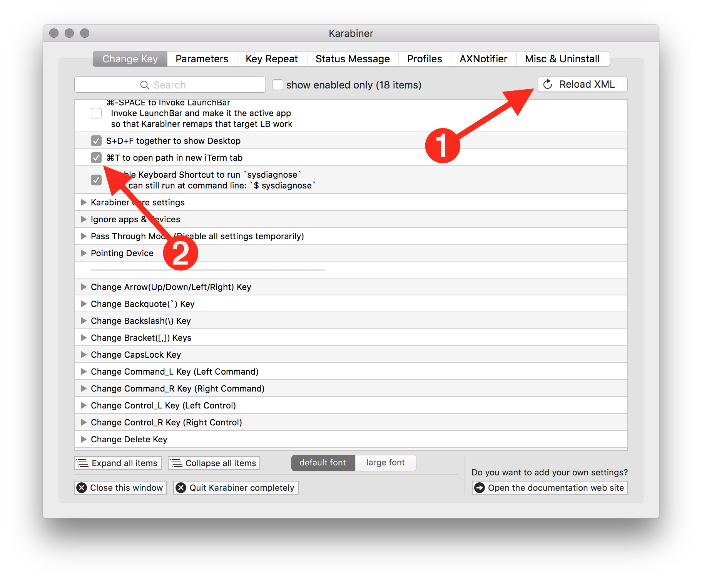

# iTerm2 LaunchBar Fix

If you are running the iTerm2 v3 beta and have set iTerm as your preferred terminal application in LaunchBar's preferences, you may have noticed that LaunchBar's terminal commands will not work. For example, selecting a path in LaunchBar and then choosing the `Open Terminal Here` command (or simply hitting ⌘T), fails silently. Read more [here](https://gitlab.com/gnachman/iterm2/issues/4447) or check out [this Twitter conversation](https://twitter.com/launchbar/status/620975715278790657).

This project is my hack to fix things. It uses Karabiner to hijack the ⌘T keystroke when LaunchBar is active. Installation is a little bit involved and assumes you are comfortable with the command line. If you'd prefer to just install a LaunchBar Action that adds commands to open a path in a new iTerm window or tab, but *does not* make the ⌘T shortcut work, [I've got you covered](https://github.com/eirkeirkeirk/iterm-launchbar-actions).

## Setup

### Helper AppleScript

First, install the included `new-iterm-tab.applescript` file. It needs to live in `/usr/local/bin/` so you can either copy it there or symlink it from the project directory to `/usr/local/bin/`. Here's a starting point for the command to make the symlink:

```bash
$ ln -s ~/projects/iterm2-lb-hack/new-iterm-tab.applescript /usr/local/bin
```

### Karabiner

I'm assuming you have [Karabiner](https://pqrs.org/osx/karabiner/) installed. If not, you'll want to do that first.

First, you'll need to enable the `Open LaunchBar By Command-Space` option. It's highlighted in orange so it's hard to miss. But you might want to use the search function to narrow down the massive list of options built into Karabiner. It this option is not turned on, Karabiner won't be able to tell when LaunchBar is the active app.


Second, you need to add some code to the `private.xml` file. From the Misc & Uninstall tab, click the `Open private.xml` button. That actually just reveals the file in Finder, but from there you can open the file in your text editor.



Paste this code within the main `<root>` node of the `private.xml` file:

```xml
<vkopenurldef>
  <name>KeyCode::VK_OPEN_URL_SHELL_open_path_in_iterm</name>
  <url type="shell">
    <![CDATA[osascript /usr/local/bin/new-iterm-tab.applescript]]>
  </url>
</vkopenurldef>
<item>
  <name>⌘T to open path in new iTerm tab</name>
  <identifier>private.command_t_in_launchbar</identifier>
  <only>LAUNCHBAR</only>
  <autogen>
    --KeyToKey--
    KeyCode::T, VK_COMMAND,
    KeyCode::C, ModifierFlag::COMMAND_L,
    KeyCode::VK_OPEN_URL_SHELL_open_path_in_iterm,
  </autogen>
</item>
```

Save `private.xml` and, back in Karabiner:

- Hit the `Reload XML` button in the Change Key tab
- Find the `⌘T to open path in new iTerm tab` option and make sure it's turned on



With that, setup is complete.

## Usage

In LaunchBar, navigate to a folder. Hit ⌘T. iTerm will activate and `cd` you into the folder. Just like it should.
